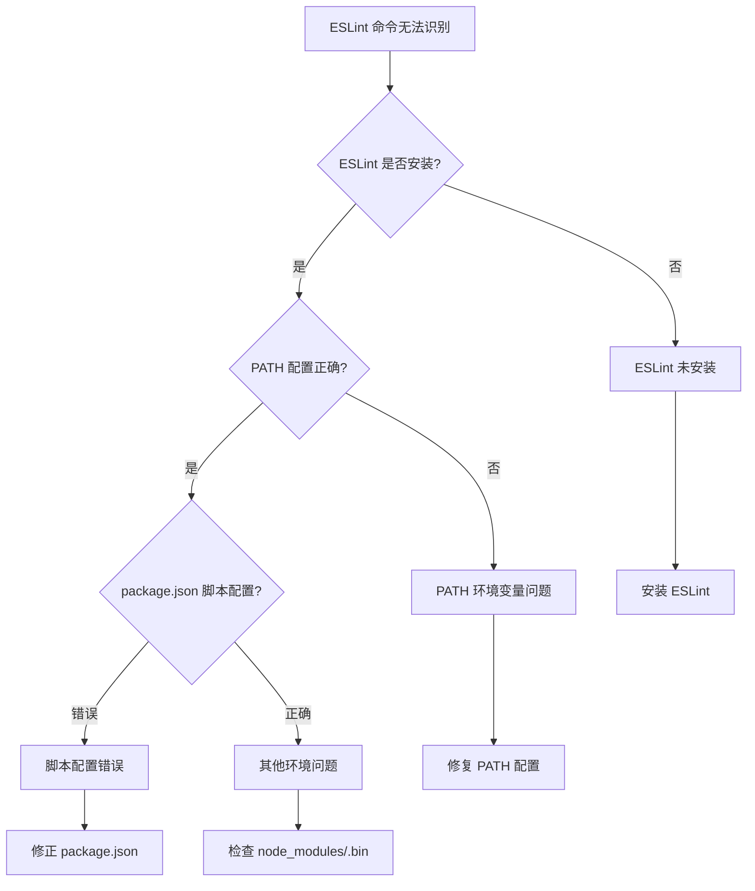

# ESLint 命令无法识别问题解决方案

## 问题描述

当运行 `npm run dev` 或其他包含 ESLint 的命令时，出现错误：
```
eslint is not recognized as internal or external command
```

## 问题原因分析



## 解决方案

### 1. 检查 ESLint 安装状态

```bash
# 检查全局安装
npm list -g eslint

# 检查本地项目安装
npm list eslint

# 检查 node_modules/.bin 目录
ls node_modules/.bin | grep eslint
```

### 2. 安装 ESLint（如果未安装）

```bash
# 本地安装（推荐）
npm install eslint --save-dev

# 或全局安装
npm install -g eslint
```

### 3. 修复 package.json 脚本配置

根据你的项目，添加正确的脚本配置：

```json
{
  "scripts": {
    "dev": "node scripts/start.js",
    "start": "node scripts/start.js",
    "build": "node scripts/build.js",
    "test": "jest",
    "lint": "eslint src/",
    "lint:fix": "eslint src/ --fix",
    "precommit": "eslint src/ && echo husky start ....",
    "prepare": "husky install"
  }
}
```

### 4. 使用 npx 运行 ESLint

如果 ESLint 已安装但仍无法识别，使用 npx：

```bash
# 使用 npx 运行
npx eslint src/

# 在 package.json 脚本中使用 npx
{
  "scripts": {
    "lint": "npx eslint src/",
    "lint:fix": "npx eslint src/ --fix"
  }
}
```

### 5. 检查和修复 node_modules/.bin

```bash
# 删除 node_modules 和 package-lock.json
rm -rf node_modules package-lock.json

# 重新安装依赖
npm install

# 验证 eslint 是否在 .bin 目录
ls node_modules/.bin | grep eslint
```

### 6. 跨平台兼容性解决方案

对于 Windows 系统兼容性问题，使用 cross-env：

```bash
# 安装 cross-env
npm install --save-dev cross-env

# package.json 配置
{
  "scripts": {
    "lint": "cross-env NODE_ENV=development npx eslint src/",
    "lint:fix": "cross-env NODE_ENV=development npx eslint src/ --fix"
  }
}
```

### 7. ESLint 配置检查

确保你的 `.eslintrc.json` 或 `package.json` 中的 ESLint 配置正确：

```json
// .eslintrc.json
{
  "extends": [
    "react-app",
    "react-app/jest"
  ],
  "parserOptions": {
    "ecmaVersion": 2021,
    "sourceType": "module",
    "ecmaFeatures": {
      "jsx": true
    }
  },
  "env": {
    "browser": true,
    "es6": true,
    "node": true
  }
}
```

### 8. 创建开发脚本

根据你的项目需要，创建 `dev` 脚本：

```json
{
  "scripts": {
    "dev": "node scripts/start.js",
    "dev:lint": "concurrently \"npm run dev\" \"npm run lint:watch\"",
    "lint:watch": "nodemon --watch src --ext js,jsx,ts,tsx --exec \"npm run lint\""
  }
}
```

## 完整的解决流程

### 步骤 1: 诊断问题

```bash
# 检查 Node.js 和 npm 版本
node --version
npm --version

# 检查 ESLint 安装
npm list eslint
which eslint  # macOS/Linux
where eslint  # Windows
```

### 步骤 2: 重新安装依赖

```bash
# 清理并重新安装
npm cache clean --force
rm -rf node_modules package-lock.json
npm install
```

### 步骤 3: 验证安装

```bash
# 验证 ESLint 可执行
npx eslint --version

# 测试 ESLint
npx eslint src/ --ext .js,.jsx,.ts,.tsx
```

### 步骤 4: 更新 package.json

```json
{
  "scripts": {
    "start": "node scripts/start.js",
    "build": "node scripts/build.js",
    "test": "jest",
    "dev": "node scripts/start.js",
    "lint": "npx eslint src/ --ext .js,.jsx,.ts,.tsx",
    "lint:fix": "npx eslint src/ --ext .js,.jsx,.ts,.tsx --fix",
    "lint:check": "npx eslint src/ --ext .js,.jsx,.ts,.tsx --max-warnings 0"
  }
}
```

## 常见错误及解决方法

### 错误 1: "eslint: command not found"

**原因**: ESLint 未安装或不在 PATH 中
**解决**: 
```bash
npm install eslint --save-dev
```

### 错误 2: "Cannot find module 'eslint'"

**原因**: node_modules 损坏  
**解决**: 
```bash
rm -rf node_modules package-lock.json
npm install
```

### 错误 3: Windows 路径问题

**原因**: Windows 路径分隔符问题
**解决**: 使用 cross-env 或正斜杠路径

### 错误 4: 权限问题

**原因**: npm 全局安装权限不足  
**解决**: 
```bash
# 使用 npx 替代全局安装
npx eslint

# 或修复 npm 权限
npm config set prefix ~/.npm-global
```

## 最佳实践

### 1. 本地安装优于全局安装

```bash
# 推荐: 本地安装
npm install eslint --save-dev

# 不推荐: 全局安装（除非必要）
npm install -g eslint
```

### 2. 使用 npx 运行命令

```bash
# 直接使用 npx
npx eslint src/

# 在脚本中使用 npx
"lint": "npx eslint src/"
```

### 3. 配置 VSCode ESLint 扩展

```json
// .vscode/settings.json
{
  "eslint.validate": [
    "javascript",
    "javascriptreact",
    "typescript",
    "typescriptreact"
  ],
  "eslint.workingDirectories": ["."],
  "editor.codeActionsOnSave": {
    "source.fixAll.eslint": true
  }
}
```

### 4. Git Hooks 集成

```json
// package.json
{
  "husky": {
    "hooks": {
      "pre-commit": "npx eslint src/ --ext .js,.jsx,.ts,.tsx"
    }
  }
}
```

## 预防措施

1. **使用 .nvmrc 锁定 Node.js 版本**
2. **定期更新依赖包**
3. **使用 package-lock.json 锁定版本**
4. **配置 CI/CD 检查 ESLint**

## 总结

ESLint 命令无法识别的问题通常是由于：
- ESLint 未正确安装
- PATH 环境变量配置错误
- node_modules 目录损坏
- package.json 脚本配置错误

使用本文档提供的解决方案，可以快速诊断和修复这些问题。推荐使用 `npx` 来运行 ESLint，确保使用项目本地安装的版本。