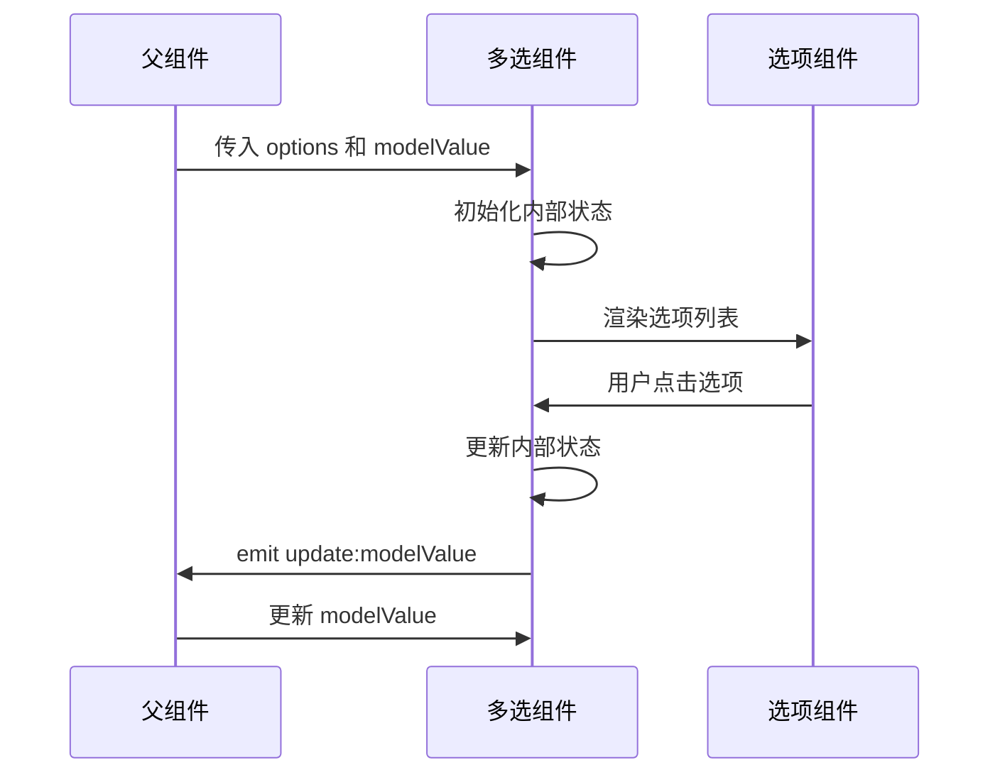

# Vue3多选组件设计文档

## 1. 组件概述

### 1.1 组件目标
设计并实现一个功能完整、可复用的Vue3多选组件，支持多种使用场景和配置选项。

### 1.2 核心特性
- 基础多选功能（复选框列表）
- 双向数据绑定
- 全选/反选功能
- 搜索过滤功能
- 分组显示
- 自定义样式和主题
- 无障碍访问支持
- 移动端适配

## 2. 技术架构

### 2.1 技术栈
- Vue 3 Composition API
- TypeScript（可选）
- CSS3 / SCSS

### 2.2 组件架构图

```mermaid
graph TD
    A[MultiSelect 主组件] --> B[Props 接口]
    A --> C[Emits 事件]
    A --> D[内部状态管理]
    A --> E[子组件]
    
    B --> B1[options 选项数据]
    B --> B2[modelValue 选中值]
    B --> B3[placeholder 占位符]
    B --> B4[disabled 禁用状态]
    B --> B5[searchable 搜索功能]
    B --> B6[multiple 多选模式]
    B --> B7[clearable 清空功能]
    
    C --> C1[update:modelValue]
    C --> C2[change 变化事件]
    C --> C3[search 搜索事件]
    C --> C4[clear 清空事件]
    
    D --> D1[selectedValues 选中值]
    D --> D2[searchText 搜索文本]
    D --> D3[filteredOptions 过滤选项]
    D --> D4[isOpen 展开状态]
    
    E --> E1[OptionItem 选项组件]
    E --> E2[SearchInput 搜索组件]
    E --> E3[SelectAll 全选组件]
```



### 2.3 数据流设计



## 3. 接口设计

### 3.1 Props 接口

| 属性名 | 类型 | 默认值 | 说明 |
|--------|------|--------|------|
| modelValue | Array | [] | 选中的值数组 |
| options | Array | [] | 选项数据数组 |
| placeholder | String | '请选择' | 占位符文本 |
| disabled | Boolean | false | 是否禁用 |
| searchable | Boolean | true | 是否支持搜索 |
| clearable | Boolean | true | 是否支持清空 |
| multiple | Boolean | true | 是否多选模式 |
| maxHeight | String | '200px' | 下拉框最大高度 |
| showSelectAll | Boolean | true | 是否显示全选 |
| labelKey | String | 'label' | 选项标签字段名 |
| valueKey | String | 'value' | 选项值字段名 |
| groupKey | String | 'group' | 分组字段名 |

### 3.2 Emits 事件

| 事件名 | 参数 | 说明 |
|--------|------|------|
| update:modelValue | value: Array | 选中值变化 |
| change | value: Array, option: Object | 选项变化 |
| search | keyword: String | 搜索事件 |
| clear | - | 清空事件 |
| selectAll | isSelectAll: Boolean | 全选/取消全选 |

### 3.3 选项数据结构

```typescript
interface Option {
  label: string;        // 显示文本
  value: any;          // 选项值
  disabled?: boolean;   // 是否禁用
  group?: string;      // 分组名称
  children?: Option[]; // 子选项（树形结构）
}
```

## 4. 功能模块设计

### 4.1 基础多选功能
- 支持单选和多选模式切换
- 复选框状态管理（选中/未选中/半选中）
- 选中值的添加和移除

### 4.2 搜索过滤功能
- 实时搜索过滤
- 支持拼音搜索（可选）
- 高亮匹配文本
- 防抖处理

### 4.3 全选功能
- 全选/取消全选
- 半选中状态处理
- 分组全选支持

### 4.4 分组显示
- 按组分类显示选项
- 组标题显示
- 组内全选功能

### 4.5 样式主题
- 默认主题
- 自定义主题支持
- 响应式设计
- 暗色模式支持

## 5. 状态管理

### 5.1 响应式数据

```javascript
const state = reactive({
  selectedValues: [],      // 选中的值
  searchText: '',         // 搜索文本
  isOpen: false,         // 下拉框展开状态
  filteredOptions: [],   // 过滤后的选项
  selectAllState: false  // 全选状态
})
```

### 5.2 计算属性

```javascript
const computedProps = {
  // 是否全选
  isAllSelected: computed(() => {
    return selectedValues.value.length === filteredOptions.value.length
  }),
  
  // 是否半选
  isIndeterminate: computed(() => {
    const selected = selectedValues.value.length
    return selected > 0 && selected < filteredOptions.value.length
  }),
  
  // 选中项显示文本
  selectedText: computed(() => {
    if (selectedValues.value.length === 0) return placeholder.value
    if (selectedValues.value.length === 1) {
      const option = options.value.find(opt => opt.value === selectedValues.value[0])
      return option?.label || ''
    }
    return `已选择 ${selectedValues.value.length} 项`
  })
}
```

## 6. 核心方法设计

### 6.1 选项操作方法

```javascript
// 切换选项选中状态
const toggleOption = (option) => {
  const index = selectedValues.value.indexOf(option.value)
  if (index > -1) {
    selectedValues.value.splice(index, 1)
  } else {
    selectedValues.value.push(option.value)
  }
  emit('update:modelValue', selectedValues.value)
  emit('change', selectedValues.value, option)
}

// 全选/取消全选
const toggleSelectAll = () => {
  if (isAllSelected.value) {
    selectedValues.value = []
  } else {
    selectedValues.value = filteredOptions.value.map(opt => opt.value)
  }
  emit('update:modelValue', selectedValues.value)
  emit('selectAll', !isAllSelected.value)
}

// 清空选择
const clearSelection = () => {
  selectedValues.value = []
  emit('update:modelValue', selectedValues.value)
  emit('clear')
}
```

### 6.2 搜索过滤方法

```javascript
// 搜索过滤
const filterOptions = (keyword) => {
  if (!keyword) {
    filteredOptions.value = options.value
    return
  }
  
  filteredOptions.value = options.value.filter(option => 
    option.label.toLowerCase().includes(keyword.toLowerCase())
  )
  
  emit('search', keyword)
}

// 防抖搜索
const debouncedSearch = debounce(filterOptions, 300)
```

## 7. 样式设计

### 7.1 CSS 变量系统

```css
:root {
  --multiselect-primary-color: #409eff;
  --multiselect-border-color: #dcdfe6;
  --multiselect-hover-color: #f5f7fa;
  --multiselect-disabled-color: #c0c4cc;
  --multiselect-text-color: #606266;
  --multiselect-placeholder-color: #c0c4cc;
  --multiselect-border-radius: 4px;
  --multiselect-font-size: 14px;
}
```

### 7.2 组件样式结构

```css
.multiselect {
  position: relative;
  display: inline-block;
  width: 100%;
}

.multiselect__trigger {
  display: flex;
  align-items: center;
  padding: 8px 12px;
  border: 1px solid var(--multiselect-border-color);
  border-radius: var(--multiselect-border-radius);
  cursor: pointer;
}

.multiselect__dropdown {
  position: absolute;
  top: 100%;
  left: 0;
  right: 0;
  z-index: 1000;
  background: white;
  border: 1px solid var(--multiselect-border-color);
  border-radius: var(--multiselect-border-radius);
  box-shadow: 0 2px 8px rgba(0, 0, 0, 0.1);
}
```

## 8. 无障碍访问

### 8.1 ARIA 属性
- `role="combobox"` 组合框角色
- `aria-expanded` 展开状态
- `aria-multiselectable="true"` 多选标识
- `aria-label` 标签描述
- `aria-describedby` 描述关联

### 8.2 键盘导航
- `Tab` 焦点切换
- `Space/Enter` 选择选项
- `Escape` 关闭下拉框
- `Arrow Up/Down` 选项导航

## 9. 性能优化

### 9.1 虚拟滚动
- 大数据量时启用虚拟滚动
- 只渲染可见区域选项
- 动态计算滚动高度

### 9.2 防抖优化
- 搜索输入防抖
- 选择状态变化防抖
- 事件触发优化

### 9.3 内存优化
- 及时清理事件监听器
- 避免内存泄漏
- 组件销毁时清理资源

## 10. 测试策略

### 10.1 单元测试
- Props 传递测试
- 事件触发测试
- 状态变化测试
- 边界条件测试

### 10.2 集成测试
- 组件交互测试
- 用户操作流程测试
- 兼容性测试

## 11. 使用示例

### 11.1 基础用法

```vue
<template>
  <MultiSelect
    v-model="selectedValues"
    :options="options"
    placeholder="请选择选项"
    @change="handleChange"
  />
</template>

<script setup>
import { ref } from 'vue'
import MultiSelect from './MultiSelect.vue'

const selectedValues = ref([])
const options = ref([
  { label: '选项1', value: 1 },
  { label: '选项2', value: 2 },
  { label: '选项3', value: 3 }
])

const handleChange = (values, option) => {
  console.log('选中值:', values)
  console.log('当前操作选项:', option)
}
</script>
```

### 11.2 分组用法

```vue
<template>
  <MultiSelect
    v-model="selectedValues"
    :options="groupedOptions"
    group-key="group"
    :show-select-all="true"
  />
</template>

<script setup>
const groupedOptions = ref([
  { label: '苹果', value: 'apple', group: '水果' },
  { label: '香蕉', value: 'banana', group: '水果' },
  { label: '胡萝卜', value: 'carrot', group: '蔬菜' },
  { label: '白菜', value: 'cabbage', group: '蔬菜' }
])
</script>
```

## 12. 扩展性设计

### 12.1 插槽支持
- `option` 自定义选项模板
- `header` 自定义头部
- `footer` 自定义底部
- `empty` 空状态模板

### 12.2 自定义渲染
- 支持自定义选项渲染函数
- 支持自定义标签渲染
- 支持自定义图标

### 12.3 插件机制
- 支持功能插件扩展
- 支持主题插件
- 支持国际化插件

## 13. 兼容性

### 13.1 浏览器兼容性
- Chrome 60+
- Firefox 60+
- Safari 12+
- Edge 79+

### 13.2 Vue 版本兼容
- Vue 3.0+
- 支持 Composition API
- 支持 TypeScript

## 14. 部署和维护

### 14.1 构建配置
- 支持 ES Module
- 支持 CommonJS
- 支持 UMD 格式
- TypeScript 声明文件

### 14.2 文档和示例
- 完整的 API 文档
- 丰富的使用示例
- 最佳实践指南
- 常见问题解答

这个设计文档为Vue3多选组件提供了完整的技术架构和实现方案，确保组件具有良好的可用性、可维护性和可扩展性。