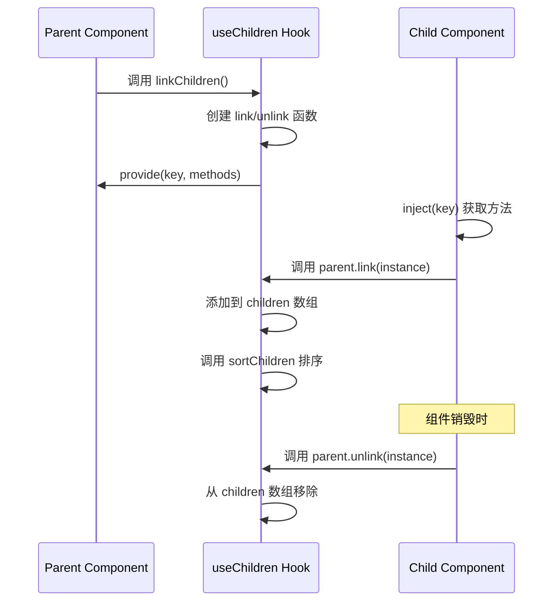

# Vue 3 useChildren Hook 详细解释

## 函数签名分析

```typescript
export function useChildren<
  Child extends ComponentPublicInstance = ComponentPublicInstance<{}, any>,
  ProvideValue = never
>(key: InjectionKey<ProvideValue>) {
  // 函数实现
}
```

### 泛型参数
- **Child**: 子组件的公共实例类型，默认为 `ComponentPublicInstance<{}, any>`
- **ProvideValue**: 通过 provide/inject 传递的值的类型，默认为 `never`

### 参数
- **key**: `InjectionKey<ProvideValue>` - 依赖注入的键，用于在父子组件间传递数据

## 核心功能解析

### 1. 响应式数组初始化

```typescript
const publicChildren: Child[] = reactive([]);
const internalChildren: ComponentInternalInstance[] = reactive([]);
const parent = getCurrentInstance()!;
```

**作用**:
- `publicChildren`: 存储子组件的公共实例，供外部使用
- `internalChildren`: 存储子组件的内部实例，用于内部管理
- `parent`: 获取当前组件实例（父组件）

### 2. linkChildren 函数

```typescript
const linkChildren = (value?: ProvideValue) => {
  const link = (child: ComponentInternalInstance) => {
    if (child.proxy) {
      internalChildren.push(child);
      publicChildren.push(child.proxy as Child);
      sortChildren(parent, publicChildren, internalChildren);
    }
  };

  const unlink = (child: ComponentInternalInstance) => {
    const index = internalChildren.indexOf(child);
    publicChildren.splice(index, 1);
    internalChildren.splice(index, 1);
  };

  provide(key, Object.assign({
    link,
    unlink,
    children: publicChildren,
    internalChildren,
  }, value));
};
```

#### link 函数
- **作用**: 注册子组件
- **流程**:
  1. 检查子组件是否有 proxy（公共实例）
  2. 将子组件添加到内部和公共数组中
  3. 调用 `sortChildren` 对子组件进行排序

#### unlink 函数
- **作用**: 注销子组件
- **流程**:
  1. 找到子组件在数组中的索引
  2. 从两个数组中同时移除该子组件

#### provide 机制
- 使用 Vue 的 provide/inject 将管理方法暴露给子组件
- 提供的对象包含:
  - `link`: 注册方法
  - `unlink`: 注销方法
  - `children`: 公共子组件数组
  - `internalChildren`: 内部子组件数组
  - 额外的 `value` 参数

### 3. 返回值

```typescript
return {
  children: publicChildren,
  linkChildren,
};
```

## 使用场景和示例

### 父组件使用

```vue
<template>
  <div class="tab-container">
    <div class="tab-headers">
      <button 
        v-for="(child, index) in children" 
        :key="index"
        @click="activeTab = index"
        :class="{ active: activeTab === index }"
      >
        {{ child.title }}
      </button>
    </div>
    <div class="tab-content">
      <slot></slot>
    </div>
  </div>
</template>

<script setup>
import { ref } from 'vue';
import { useChildren } from './useChildren';

// 定义注入键
const TAB_KEY = Symbol('tab');

// 使用 useChildren
const { children, linkChildren } = useChildren(TAB_KEY);
const activeTab = ref(0);

// 提供父组件数据给子组件
linkChildren({
  activeTab,
  setActiveTab: (index) => {
    activeTab.value = index;
  }
});
</script>
```

### 子组件使用

```vue
<template>
  <div v-show="isActive" class="tab-pane">
    <slot></slot>
  </div>
</template>

<script setup>
import { inject, computed, getCurrentInstance, onBeforeUnmount } from 'vue';

const props = defineProps({
  title: String
});

// 注入父组件提供的数据
const parent = inject(TAB_KEY);
const instance = getCurrentInstance();

// 注册当前组件到父组件
parent.link(instance);

// 组件销毁时注销
onBeforeUnmount(() => {
  parent.unlink(instance);
});

// 计算是否为活跃状态
const isActive = computed(() => {
  return parent.children.indexOf(instance.proxy) === parent.activeTab.value;
});
</script>
```

## 核心设计模式

### 1. Provider/Consumer 模式



### 2. 响应式数据管理

```typescript
// 响应式数组自动触发更新
const publicChildren = reactive([]); // 当数组变化时，使用该数组的组件会自动重新渲染

// 父组件中的模板会自动响应 children 数组的变化
children.value.forEach(child => {
  // 访问子组件的属性和方法
  console.log(child.title);
});
```

## 实际应用场景

### 1. Tab 标签页组件
- 父组件管理多个 Tab 子组件
- 动态显示 Tab 标题
- 切换活跃状态

### 2. Form 表单组件
- 父组件收集所有 FormItem 子组件
- 统一验证所有表单项
- 收集表单数据

### 3. Menu 菜单组件
- 父组件管理 MenuItem 子组件
- 处理菜单展开/折叠
- 管理选中状态

### 4. List 列表组件
- 父组件管理 ListItem 子组件
- 批量操作选中项
- 虚拟滚动管理

## 优势特点

### 1. 类型安全
- 使用 TypeScript 泛型确保类型安全
- 子组件实例类型可自定义

### 2. 响应式
- 基于 Vue 3 reactive 实现
- 子组件增删会自动触发视图更新

### 3. 灵活性
- 支持传递额外的 value 参数
- 可扩展更多父子组件通信功能

### 4. 生命周期管理
- 自动处理子组件的注册和注销
- 与 Vue 组件生命周期完美集成

## 注意事项

### 1. 内存泄漏预防
```typescript
// 子组件必须在销毁时调用 unlink
onBeforeUnmount(() => {
  parent?.unlink?.(getCurrentInstance());
});
```

### 2. 组件排序
- `sortChildren` 函数确保子组件顺序与 DOM 顺序一致
- 对于位置敏感的组件特别重要

### 3. 错误处理
```typescript
// 检查 parent 是否存在
if (!parent) {
  console.warn('useChildren: parent not found');
  return;
}
```

## 总结

`useChildren` Hook 是一个强大的父子组件通信工具，它：

1. **简化了组件间的通信**：通过 provide/inject 机制自动建立父子关系
2. **提供了响应式的子组件管理**：父组件可以实时获取子组件列表
3. **支持动态组件**：子组件可以动态注册和注销
4. **类型安全**：完整的 TypeScript 支持
5. **易于扩展**：可以通过 value 参数传递额外功能

这种设计模式在组件库开发中非常常见，如 Element Plus、Ant Design Vue 等都使用了类似的机制来管理复杂的组件关系。